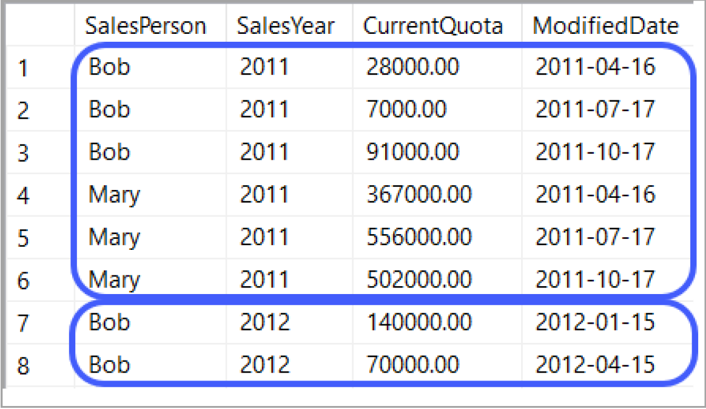
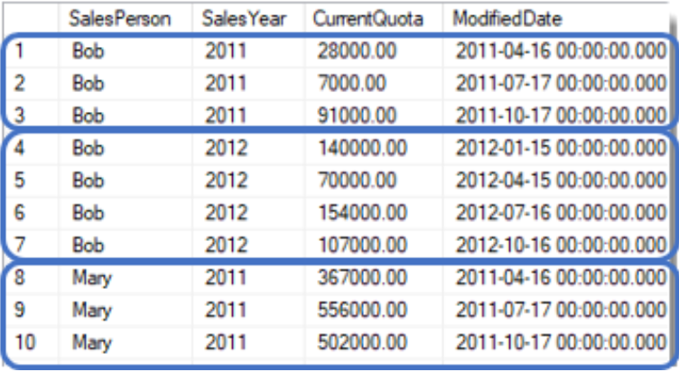
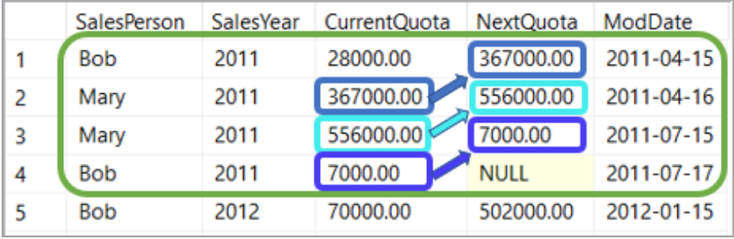
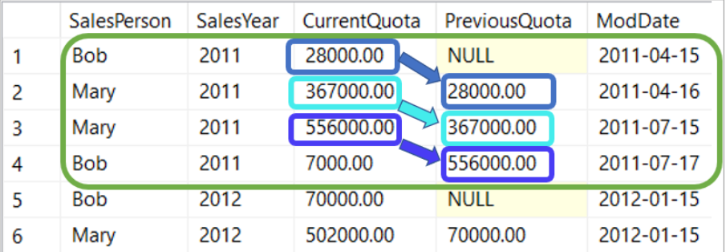

# Contents

1. Summarizing Data. (Aggreagte functions, CASE)
2. Date and Math functions
3. Processing Data with T-SQL (Loops, Derived Tables and CTE)
4. Windowing and it's common functions

## Chapter 1: Summarizing Data

We summarize date using Aggregate functions.

- Aggregate functions

#### Some exercises

```sql
SELECT Country, AVG(InternetUse) As MeanInternetUse,
MIN(GDP) As SmallestGDP,
MAX(InternetUse) As MaxInternetUSe
FROM EconomicIndicators
GROUP BY Country
HAVING MAX(InternetUse) > 1000
```

```sql
-- Calculate the aggregations by Shape
SELECT Shape,
       AVG(DurationSeconds) AS Average, 
       MIN(DurationSeconds) AS Minimum, 
       MAX(DurationSeconds) AS Maximum
FROM Incidents
GROUP BY Shape
-- Return records where minimum of DurationSeconds is greater than 1
having min(DurationSeconds) > 1
```

- Dealing with Missing Data

Blank is not NULL

- A blank is not the same as a NULL value
- May show up in columns containing texts
- An Empty string '' can be used to find blank values
- The best way is look for a column where the length or LEN > 0

```sql
SELECT country,GDP Year
FROM EconomicIndicators
WHERE LEN(GDP) > 0
```

- Replacing Null values
`ISNULL(column, 'replacedValue')` is there are any nulls it will be replaced with the `replacedValue`

```sql
SELECT GDP, Country
ISNULL(Country, 'Unknown') As NewCountry
FROM EconomicIndicators
```

we can replace with existing column

```sql
SELECT TradeGDPPercent, ImportantGoodPercent
ISNULL(TradeGDPPercent, ImportantGoodPercent) As NewCountry
FROM EconomicIndicators
```

we have also another method
`COALESCE(value_1, value_2, value_3, ... value_n)` returns the first non-missing value

```sql
SELECT TradeGDPPercent, ImportantGoodPercent
COALESCE(TradeGDPPercent, ImportantGoodPercent, 'N/A') As NewCountry
FROM EconomicIndicators
```

##### Binning Date with Case

The case statement allows us to evaluate records like an if statement

for example, we can check if a record contains a value and if it does exist we then replace it with a value from our choice, and if it doesn't we can replace it with another value

```sql
CASE
    WHEN Boolean_expression THEN result_expression [...n]
    [ELSE else_result_expression]
END
```

The ELSE is optional

```sql
SELECT Continent, 
CASE 
    WHEN Continent = 'Europe' or Continent = 'Asia' THEN 'Eurasia' 
    ELSE 'Other' 
END As NewContinet
FROM EconomicIndicators
```

we can use `CASE` to create `groups` which are often called `bins`

```sql
SELECT Country, LifeExp
CASE 
    WHEN LifeExp < 30 THEN 1
    WHEN LifeExp > 29 AND LifeExp < 40 THEN 2
    WHEN LifeExp > 39 AND LifeExp < 50 THEN 3
    WHEN LifeExp > 49 AND LifeExp < 60 THEN 4
    ELSE 5
    END AS LifeExpGroup
FROM EconomicIndicators
WHERE Year = 2007
```

another example

```sql
-- Complete the syntax for cutting the duration into different cases
SELECT DurationSeconds, 
-- Start with the 2 TSQL keywords, and after the condition a TSQL word and a value
      CASE WHEN (DurationSeconds <= 120) THEN 1
-- The pattern repeats with the same keyword and after the condition the same word and next value          
       when (DurationSeconds > 120 AND DurationSeconds <= 600) then 2
-- Use  same syntax here             
       when (DurationSeconds > 601 AND DurationSeconds <= 1200) then 3
-- Use same syntax here               
       when (DurationSeconds > 1201 AND DurationSeconds <= 5000) then 4
-- Specify a value      
       ELSE 5 
       END AS SecondGroup   
FROM Incidents
```

## Chapter 2: Math Functions

- Count and sum

```sql
-- Count the number of rows by MixDesc
SELECT MixDesc, count(*)
FROM Shipments
GROUP BY MixDesc
```

- Dates

`DATEPART` is used to determine what part of the date you want to Calculate, some of the common abbreviation are:

- `DD` for Day
- `MM` for Month
- `YY` for Year
- `HH` for Hour

`DATEADD(DATEPART, number, date)` Add or subtract datetime values
    - Always returns a date

what is the date is 30 days from Jun 12, 2020? and also 30 days before

```sql
SELECT DATEADD(DD, 30, '2020-06-21') as after_days, DATEADD(DD, -30, '2020-06-21') as before_days;
```

`DATEDIFF(datepart, startdate, enddate)` Obtain the difference between two datetime values
    - Always returns a number

```sql
SELECT DATEDIFF(DD, '2020-05-22', '2020-06-21') as diff1
 DATEDIFF(DD, '2020-07-21', '2020-06-21')as diff1
```

### Practical Example

- Write a query that returns the number of days between OrderDate and ShipDate.

```sql
SELECT OrderDate, ShipDate, DATEDIFF(DD, OrderDate, ShipDate) as Duration
FROM Shipments
```

- Write a query that returns the approximate delivery date as five days after the ShipDate.

```sql
SELECT OrderDate, DATEADD(DD, 5, ShipDate) As DeliveryDate FROM Shipments
```

- Rounding And Truncating numbers

`ROUND(number, length, [, function])`
-> length: the number of places the number should be rounded.

```js
if(length < 0)
    roundLeftNumber()
else
    roundRightNumber()
```

```sql
-- Round Cost to the nearest dollar
SELECT Cost, 
       round(Cost, 0) AS RoundedCost
FROM Shipments
```

```sql
-- Truncate cost to whole number
SELECT Cost, 
       round(Cost, 0, 1) AS TruncateCost
FROM Shipment
```

- Absolute, square root, square, logarithm
- `ABS()`
- `SQUARE()`
- `SQRT()`
- `LOG()`

```sql
-- Return the absolute value of DeliveryWeight
SELECT DeliveryWeight,
       abs(DeliveryWeight) AS AbsoluteValue
FROM Shipments

-- Return the square and square root of WeightValue
SELECT WeightValue, 
       square(WeightValue) AS WeightSquare, 
       sqrt(WeightValue) AS WeightSqrt
FROM Shipments
```

## Chapter 3: Processing Data

- While Loops
While loops here are just as in programming languages exactly

```sql
DECLARE @CTR INT
SET @CTR = 1
WHILE @CTR < 10
    BEGIN
        SET @CTR = @CTR + 1
        IF @CTR = 4
            BREAK
    ENd
SELECT @CTR
```

- Derived Tables
Derived Tables are another name for a query acting as a table and are commonly used to do aggregations in T-SQL

we used derived table when we need to break down a complex query into smaller steps
it's a great solution, if we want to create intermediate Calculations that need to ne used in a larger query

They are specified in the `FROM` clause

```sql
SELECT a.* FROM Kidney a
-- this derived table computes the average age joined to the actual table
JOIN(SELECT AVG(Age) As AverageAge FROM Kidney b) 
On a.Age = b.AverageAge
```

```sql
SELECT a.RecordId, a.Age, a.BloodGlucoseRandom, 
-- Select maximum glucose value (use colname from derived table)    
       b.MaxGlucose
FROM Kidney a
-- Join to derived table
JOIN (SELECT Age, MAX(BloodGlucoseRandom) AS MaxGlucose FROM Kidney GROUP BY Age) b
-- Join on Age
on a.Age = b.Age
```

-- you will create a derived table to return all patient records with the highest BloodPressure at their Age level

```sql
SELECT * FROM Kidney a
JOIN (SELECT Age, MAX(BloodPressure) AS MaxBloodPressure FROM Kidney GROUP BY Age) b
ON a.BloodPressure = b.MaxBloodPressure
AND a.Age = b.Age
```

- CTES (Common Table Expression)
are another type of derived table, they are little different as they can be used multiple times in a query and are defined like a table. [Defined before you use it]

```sql
WITH CTEName(Col1, Col2)
AS
(
    SELECT Col1, Col2,
    FROM TableName
)
```

the columns names need to maatch coluns in the query

### Some Exercises

```sql
-- create a CTE to get the maximum BloodPressure by age
WITH BloodPressureAge(Age, MaxBloodPressure)
AS
(
    SELECT Age, Max(BloodPressure) As MaxBloodPressure
    FROM Kidney
    GROUP BY Age
)

-- create a query to use CTE as a table
SELECT a.Age, MIN(a.BloodPressure), b.MaxBloodPressure
FROM Kideny a
JOIN BloodPressureAge b 
ON a.Age = b.Age
GROUP BY a.Age, b.MaxBloodPressure
```

```sql
-- Specify the keyowrds to create the CTE
WITH BloodGlucoseRandom (MaxGlucose) 
AS(SELECT MAX(BloodGlucoseRandom) AS MaxGlucose FROM Kidney)

SELECT a.Age, b.MaxGlucose
FROM Kidney a
-- Join the CTE on blood glucose equal to max blood glucose
JOIN BloodGlucoseRandom b
on a.BloodGlucoseRandom = b.MaxGlucose
```

```sql
-- Create the CTE
WITH BloodPressure (MaxBloodPressure)
AS (
    SELECT MAX(BloodPressure) as MaxBloodPressure
    FROM Kidney
)

SELECT *
FROM Kidney a
-- Join the CTE  
Join BloodPressure b
on a.BloodPressure = b.MaxBloodPressure
```

## Chapter 4: Window functions

### Intro

Window functions provides the ability to create and analyze groups of data.
With window functions, we can look at the current row, next row and previous row
all at the same time very efficiently

Data here are processed as a group, allowing each group to be evaluated seperately



here the data are seperated onto groups based on `SalesYear`

we've different categories of window functions

- Aggreate functions - AVG, SUM, COUNt, ...
- Ranking Functions - RANK, DENSE_RANK, ROW_NUMBER, ...
- Analytic functions - LEAD, LAG, FIRST_VALUE, LAST_VALUE, ...

using windowing function, you can create a query to return values by year, without knowing the value of year is!

- Window function is create by OVER() clause
- to arrange the results, use ORDER BY.
- Allows aggregations to be created at the same time as the window.

`OVER` accepts:

- `PARTITON BY` which creates the frame, dividing the query result set into partitions, the window function is applied to each partition seperately, if you do not include the PARTITION BY the frame is entire table
- `ORDER BY` which determines the logical orders of rows
- `RANGE` or `ROWS` which limites the rows within the parition by Specifying the start and end points within the partition.

the default for `ROWS` or `RANGE` clause is

```sql
RANGE BETWEEN UNBOUNDED PRECEDING AND CURRENT ROW`
```

which means => Do the windowing function from the start of the result set to the current row [cumulatively]
for example

```sql
SELECT Name, Gender, Salary
AVG(Salary) OVER (Order By Salary) as [AVG],
SUM(Salary) OVER(Order By Salary) as [SUM],
COUNT(Salary) OVER (ORDER BY Salary) as [COUNT]
FROM Employee
```

would result in

|Name|Gender | Salary | AVG | SUM | COUNT
| -- | -- | -- | -- | -- | -- |
| t | M | 1000 | 1000 | 1000 | 1
| l | f | 2000 | 1500 | 3000 | 2
| x | f | 3000 | 2000 | 6000 | 3
| y | M | 4000 | 2500 | 10000 | 4
| z | f | 5000 | 3000 | 15000 | 5
| j | M | 6000 | 3500 | 21000 | 6

the avg result for 3rd row is the average of (1st row to the 3rd row)

there's also another values for `RANGE`

```sql
RANGE BETWEEN UNBOUNDED PRECEDING AND UNBOUNDED FOLLOWING`
```

which means => Do the windowing function from the start of the result set to the current row [cumulatively] # for the entire result set

for example

```sql
SELECT Name, Gender, Salary
AVG(Salary) OVER (Order By Salary RANGE BETWEEN UNBOUNDED PRECEDING AND UNBOUNDED FOLLOWING) as [AVG],
SUM(Salary) OVER(Order By Salary RANGE BETWEEN UNBOUNDED PRECEDING AND UNBOUNDED FOLLOWING) as [SUM],
COUNT(Salary) OVER (ORDER BY Salary RANGE BETWEEN UNBOUNDED PRECEDING AND UNBOUNDED FOLLOWING) as [COUNT]
FROM Employee
```

would result in

|Name|Gender | Salary | AVG | SUM | COUNT
| -- | -- | -- | -- | -- | -- |
| t | M | 1000 | 3500 | 21000 | 6
| l | f | 2000 | 3500 | 21000 | 6
| x | f | 3000 | 3500 | 21000 | 6
| y | M | 4000 | 3500 | 21000 | 6
| z | f | 5000 | 3500 | 21000 | 6
| j | M | 6000 | 3500 | 21000 | 6

```sql
OVER(PARTITION BY SalesPerson Order By SalesYear)
```

```sql
SELECT SalesPerson, SalesYear, CurrentQuota,
       SUM(CurrentQuota)
       OVER(PARTITION BY SalesYear) As YearlyTotal,
       ModifiedDate AS ModDate
FROM SalesGoal
```

- Write a T-SQL query that returns the sum of OrderPrice by creating partitions for each TerritoryName

```sql
SELECT OrderID, TerritoryName, 
       -- Total price for each partition
       sum(OrderPrice) 
       -- Create the window and partitions
       OVER(partition BY TerritoryName) AS TotalPrice
FROM Orders
```

|OrderID| TerritoryName| TotalPrice|
|--|--|--|
|43706| Australia |1469|
|43722 |Australia |1469|

--  calculate the number of orders in each territory.

```sql
SELECT OrderID, TerritoryName,
       COUNT(TerritoryName)
       OVER(PARTITION BY TerritoryName) AS TotalOrders
FROM Orders
```

|OrderID| TerritoryName| TotalOrders|
|--|--|--|
|43706| Australia |13|
|43722 |Australia |16|

### Common Window functions

we'll cover 4 commonly used windowing functions

- `FIRST_VALUE`
- `LAST_VALUE`
- `LEAD`
- LAG`

(`FIRST_VALUE`, `LAST_VALUE`) each one of them return only one value for the entire window



```sql
SELECT SalesPerson, SalesYear, CurrentQuota,
       -- first value from every window 
       FIRST_VALUE(CurrentQuota)
       OVER (PARTITION BY SalesYear ORDER BY ModifiedDate) As StartQuote,
       -- last value from every window
       LAST_VALUE(CurrentQuota)
       OVER (PARTITION BY SalesYear ORDER BY ModifiedDate) As EndQuote,
       ModifiedDate as ModDate
FROM SalesGoal
```

The `ORDER BY` is required in the `OVER` statement adter the column bein paritioned, because the order values appear in the window and that determines the first or last value

|SalesPerson |SalesYear |CurrentQuota|StartQuota| EndQuota |ModDate   |
|--|--|--|--|--|--|
 |Bob         |2011      |28000.00    |28000.00  |91000.00  |2011-04-16|
 |Bob         |2011      |7000.00     |28000.00  |91000.00  |2011-07-17|  
 |Bob         |2011      |91000.00    |28000.00  |91000.00  |2011-10-17|
 |Bob         |2012      |140000.00   |140000.00 |107000.00 |2012-01-15|
 |Bob         |2012      |70000.00    |140000.00 |107000.00 |2012-04-15|
 |Bob         |2012      |154000.00   |140000.00 |107000.00 |2012-07-16|
|Bob         |2012      |107000.00   |140000.00 |107000.00 |2012-10-16|

(`LEAD`, `LAG`)
Using `LEAD` we can compare the value of the current row to the value of the next row
Using `LAG` we can compare the value of the current row to the value of the previous row

- they both provide the ability to query values from the [next, previous] row
- requires using ORDER BY


For the last row in the window, the `LEAD` value is null

For the first row in the window, the `LAG` value is null

```sql
SELECT SalesYear, SalesPerson, CurrentQuota
    -- create a window function LEAD()
    LEAD(CurrentQuota)
    OVER (PARTITION BY SalesYear ORDER BY ModifiedDate) as NextQoute,
    LAG(CurrentQuota)
    OVER (PARTITION BY SalesYear ORDER BY ModifiedDate) as PreviousQoute,
    ModifiedDate as ModDate
FROM SalesGoal
```

** note:
`ORDER BY` is required only when using common windowing functions (LEAD, LAG, FIRST_VALUE, LAST_VALUE) but not required when using
aggregation functions (SUM, AVG, ...)

#### Time to practice

- Suppose you want to figure out the first OrderDate in each territory or the last one. How would you do that?

```sql
SELECT TerritoryName, OrderDate,
    FIRST_VALUE(OrderDate)
    OVER (PARTITION BY TerritoryName ORDER BY OrderDate) as FirstOrderDate,
    LAST_VALUE(OrderDate)
    OVER (PARTITION BY TerritoryName ORDER BY OrderDate) as LastOrderDate,
FROM Orders
```

|TerritoryName |OrderDate |FirstOrder|
|--|--|--|
|Australia |2015-02-23 09:00:00 |2015-02-23 09:00:00|
|Australia |2015-02-23 11:00:00 |2015-02-23 09:00:00|
|Australia |2015-02-23 12:00:00 |2015-02-23 09:00:00|
|Australia |2015-04-23 02:00:00 |2015-02-23 09:00:00|

- Suppose you want to know the next and previous order for each TerritoryName?

```sql
SELECT TerritoryName, OrderDate,
LAG(OrderDate) OVER PARTITION BY(TerritoryName ORDER BY OrderDate) as previousOrder,
LEAD(OrderDate) OVER PARTITION BY(TerritoryName ORDER BY OrderDate) as nextOrder
FROM Orders
```

|TerritoryName| OrderDate |PreviousOrder |NextOrder|
|--|--|--|--|
|Australia |2015-02-23 09:00:00 |null| 2015-02-23 11:00:00|
|Australia |2015-02-23 11:00:00 |2015-02-23 09:00:00 |2015-02-23 12:00:00|

### Increasing the Complexity of Windowing functions

Calculating running totals, and the problem we'll face when doing so with Windowing function and how to overcome those problems ?
First let's take a look at what we did in this previous example

```sql
SELECT SalesYear, SalesPerson, CurrentQuota
SUM(CurrentQuota) OVER (PARTITION BY SalesYear) as YearlyTotal,
ModifiedDate as ModDate
FROM SalesGoal
```

|SalesPerson |SalesYear |CurrentQuota|YearlyTotal | ModDate  |
|------------|----------|------------|------------|----------|
|Bob         |2011      |28000.00    |1551000.00  |2011-04-16|
|Bob         |2011      |7000.00     |1551000.00  |2011-07-17|  
|Bob         |2011      |91000.00    |1551000.00  |2011-10-17|
|Mary        |2011      |140000.00   |1551000.00  |2012-04-15|
|Mary        |2011      |70000.00    |1551000.00  |2012-07-15|
|Mary        |2011      |154000.00   |1551000.00  |2012-01-15|
|Mary        |2012      |107000.00   |1859000.00  |2012-01-16|

you'll notice that we have `one total` for each window
Now if we take the same query and add `ORDER BY` clause in the `OVER` clause, you will see different result

```sql
SELECT SalesPerson, SalesYear, CurrentQuota
SUM(CurrentQuota) OVER (PARTITION BY SalesYear ORDER BY SalesPerson),
ModifiedDate as ModDate
FROM SalesGoal
```

|SalesPerson |SalesYear |CurrentQuota|YearTotal   | ModDate  |
|------------|----------|------------|------------|----------|
|Bob         |2011      |28000.00    |35000.00    |2011-04-16|
|Bob         |2011      |7000.00     |35000.00    |2011-07-17|  
|Mary        |2011      |367000.00   |958000.00   |2011-10-17|
|Mary        |2011      |367000.00   |958000.00   |2012-04-15|
|Bob         |2012      |70000.00    |401000.00   |2012-07-15|
|Bob         |2012      |154000.00   |401000.00   |2012-10-16|

Because now the values in the CurrentQuota column are totaled by SalesPerson and SalesYear
so let's break down what've happened
we've partitioned by SalesYear beside Ordering by SalesPerson
so for example,
year `2011` and `Bob` => 28000 + 7000 = 35000
year `2011' and 'Mary` => 367000 + 367000 =

Creating running totals
You usually don't have to use ORDER BY when using aggregations, but if you want to create running totals, you should arrange your rows

## Further Read

- <a href="https://learnsql.com/blog/sql-window-functions-vs-group-by"> Difference between GROUP BY vs Window function </a>
- <a href="https://codingsight.com/calculating-running-total-with-over-clause-and-partition-by-clause-in-sql-server/">calculating Running total using OVER clause and PARTITION BY </a>
- <a href="https://www.youtube.com/watch?v=TzsrO4zTQj8">window functions in SQL Server </a>

- <a href="https://www.youtube.com/watch?v=jQWSMHrQPOc">Intro to Windowing Concept</a>
- <a href="https://www.youtube.com/watch?v=XBE09l-UYTE">Windowing functions for Technical Interview [Advanced] </a>
